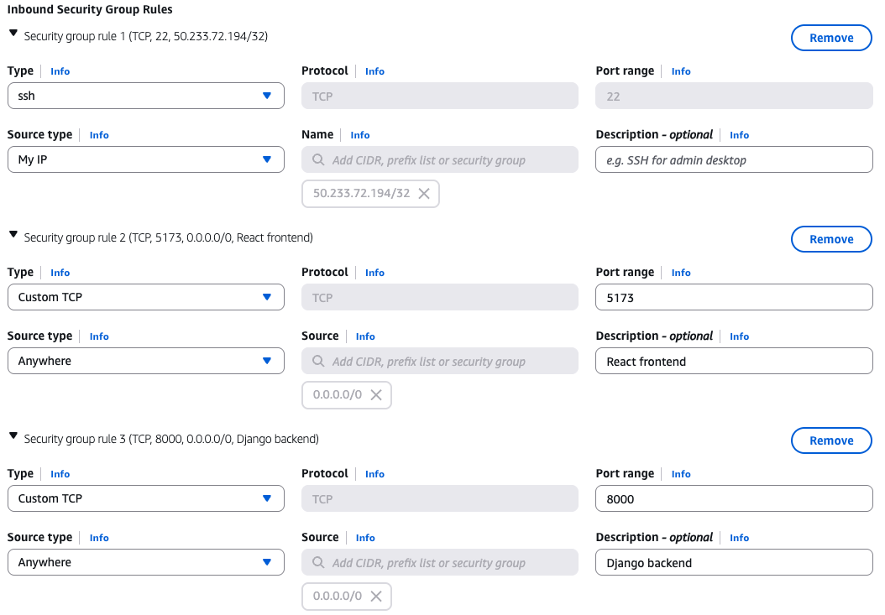
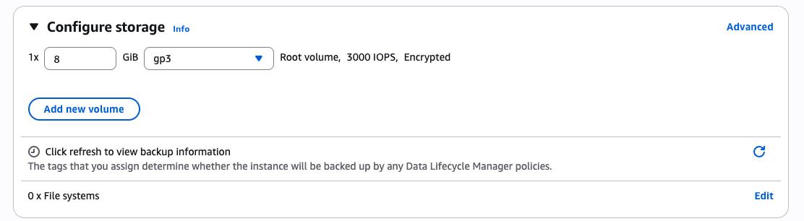
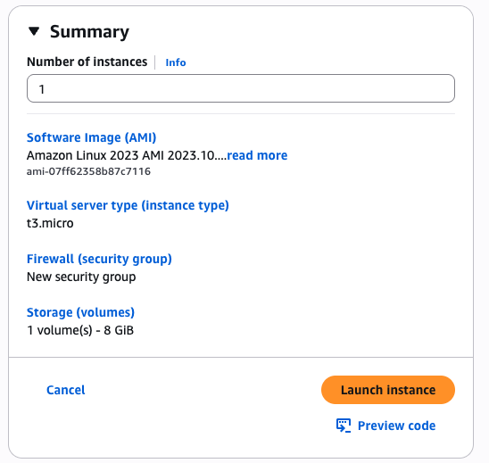

# Creating a New EC2 Instance
First, make sure you have an AWS account (it can be free tier). If you don't, create a free account [here](https://aws.amazon.com/free/?trk=0737953a-5bcb-42c3-bdbe-bdfc3cc79c51&sc_channel=ps&trk=0737953a-5bcb-42c3-bdbe-bdfc3cc79c51&sc_channel=ps&ef_id=CjwKCAiA7LzLBhAgEiwAjMWzCGR1IFDeaevpKEqDi0DXbOk9KGuIUbkO3XyG3p1FYqHdXEudSKLA8RoCvNEQAvD_BwE:G:s&s_kwcid=AL!4422!3!651751058790!e!!g!!create%20aws%20account!19852662149!145019243897&gad_campaignid=19852662149&gbraid=0AAAAADjHtp8whHkxPFa08Lu1xTW8SCOZt&gclid=CjwKCAiA7LzLBhAgEiwAjMWzCGR1IFDeaevpKEqDi0DXbOk9KGuIUbkO3XyG3p1FYqHdXEudSKLA8RoCvNEQAvD_BwE). Then, in the search bar look for "EC2" and click it when it shows up. Then click "launch instance" and set the name to whatever you would like. For the quick start, select "Amazon Linux", instance type can use "t3.micro". Then create a key pair for login and save it as your-application-name(REPLACE WITH YOUR ACTUAL NAME)-key-pair or anything else you will remember. For network settings, click the "Edit" button on the right at the top of the "Network Settings" window. From here, you can add custom security groups. 

A security group controls which IP addresses are able to interact with your EC2 instance and which ones it is able to interact with. 

Keep the existing SSH security group rule using the TCP protocol, but update the source type to "My IP" for better security. Now, we will add two more security group rules with "anywhere" source types: one for the frontend (5173) and one for the backend (8000). When you're done, everything should look like this: 

Note that there is no security rule for the database. This is because we only want the backend to communicate with the database over Docker's internal network, not the public internet. 

For storage, click "Advanced" and switch "Not encrypted" to "Encrypted". Everything else can remain on the default settings. If this is done correctly, it should look like the below: 

Now you're ready to launch your instance. The summary should look like this: 

Then click launch! Click next once the instance finishes starting up. 