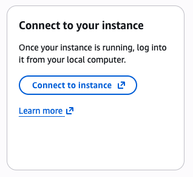

# Installing Docker and Docker Compose
Your EC2 instance is now ready for your Docker application, but it doesn't have Docker or Docker compose installed yet or the images necessary to run it. After you launch your EC2 instance you'll see a gallery of options, but click on the one that looks like the below: 



It will automatically select "Connect using a public IP", so you can copy the "Public IPv4 address". Now, you'll ssh into your EC2 instance using the following commands, but first copy the path of your key pair certificate on your computer to your clipboard! For the second line, you will need the EC2 instance's public ip address, which you just copied. 

:::tip
If you want to learn about what SSH is, check out [this video](https://www.youtube.com/watch?v=ORcvSkgdA58)! 
:::

```bash
chmod 400 /REPLACE/WITH/PATH/TO/YOUR/KEY/PAIR.pem # ensures key isn't publicly accessible or editable, replace with actual path
ssh -i /REPLACE/WITH/PATH/TO/YOUR/KEY/PAIR.pem ec2-user@YOUR_PUBLIC_IP # sshs into ec2 instance, replace with actual path and actual IP address
```

The second command will require a confirmation for whether or not you want to continue connecting, say "yes" to continue. 

Now, you need to install Docker and Docker compose. Install Docker with this command: 

```bash
sudo yum update -y # update yum before installing docker! 

sudo yum install -y docker # installs docker

# start Docker service
sudo systemctl start docker

# make sure docker starts on boot
sudo systemctl enable docker

# allow ec2-user to run without sudo (gives user permissions)
sudo usermod -a -G docker ec2-user

exit # allows you to log back in for permission changes to take effect
```

Now, ssh back in the same way as before: 
```bash
ssh -i /REPLACE/WITH/PATH/TO/YOUR/KEY/PAIR.pem ec2-user@YOUR_PUBLIC_IP
```

Since our EC2 instance is on an Amazon Linux, use the following command to install the `docker-compose-plugin` package: 

```bash
sudo yum install -y docker-compose-plugin
```

Then, verify both installations using: 

```bash
docker version
docker compose version
```

Once you're done, click next to learn how to add your GitHub repo files to the instance. 